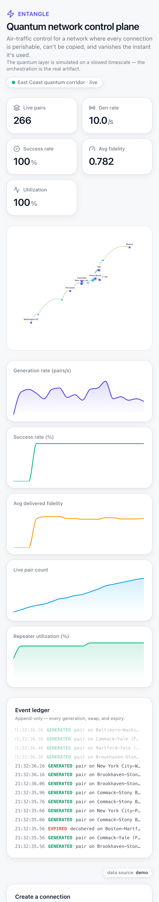

# Entangle — demo walkthrough

A 3–4 minute script for showing Entangle to judges. Works fully **offline** (the
in-process demo simulator) or against **live AWS**. The header badge and the
`X-Entangle-Source` response header tell you which is active.


## 0. One-time setup

```bash
pnpm install
cd apps/web && ENTANGLE_DEMO_MODE=1 pnpm dev     # http://localhost:3000
```

> For the live AWS path instead: provision (see `infra/README.md`), fill `.env`,
> `pnpm infra:migrate && pnpm infra:seed`, then `pnpm dev:engine` + `pnpm dev:web`.

The app **pre-warms**, so the map is already alive and the dashboards are
populated the moment it loads. Gentle background traffic keeps charts moving.

## 1. The one-liner (15s)

> "This is air-traffic control for a network where every connection is
> perishable, can't be copied, and vanishes the instant it's used. The quantum
> layer is simulated on a slowed timescale — the orchestration is the real
> artifact."

Point at the **map**: arcs are entangled-pair links, colored by live fidelity
(emerald = high, amber → red as they decohere). Pulsing halos mark the real
Long Island / NY testbed core (NYSQIT / SCY-QNet); the spine runs down to DC.

## 2. It breathes (20s)

Watch the arcs fade and recover — pairs are generated stochastically and decay
continuously. Nothing is on a schedule. The **stat tiles** count live pairs,
generation rate, success rate, average delivered fidelity, and link coverage.

## 3. The headline route: NYC → Washington DC (45s)

There is **no direct NYC–DC link** — by design. Click **"New York City →
Washington DC"**.

- The request appears in the **Requests** feed as `PENDING`, then `FULFILLED`.
- The map **highlights the fulfilled path**: `NYC → Princeton → Philadelphia →
  Baltimore → DC`, with a bright pulse running the chain.
- The feed shows the **delivered fidelity** (≈ the product of the per-hop
  fidelities) and the **hop count**.

> "It found a 4-hop route, reserved a pair on each hop, performed entanglement
> swaps at the repeaters, and delivered one end-to-end pair — before any link
> decayed below the floor."

## 4. No-cloning proof (30s)

Open the **No-cloning proof** panel, set ~20 concurrent attempts, click **Run
the proof**. Result: **1 of 20 succeeded**.

> "A Bell pair can't be copied. We fire many simultaneous reservation attempts at
> a single pair; exactly one wins. That's the no-cloning theorem enforced by a
> DynamoDB conditional write — `status = AVAILABLE` — every loser gets
> `ConditionalCheckFailedException`."

## 5. Inject a link failure → live reroute (30s)

In **Simulation controls**, pick a link on the active route (e.g.
`Philadelphia – Baltimore`) and hit **Fail**.

- Every pair on that link expires instantly (watch the arc drop to red/empty).
- **Link coverage** (utilization) dips.
- The next NYC→DC request must find a different path or fail if none qualifies —
  demonstrating real-time replanning over perishable inventory.

## 6. Tune the physics (20s)

Drag **Generation rate** and **Decoherence rate**. Crank decoherence up and watch
links redden and expire faster, success rate fall, and the event ledger fill with
`EXPIRED` and `FAILED`. **Pause** freezes the whole simulation.

## 7. The architecture point (30s)

> "Two AWS databases, each for what it's best at: **DynamoDB** holds the live,
> perishable pair inventory — single-digit-millisecond conditional writes are
> what make the no-cloning guarantee atomic, and TTL auto-expires decayed pairs.
> **Aurora PostgreSQL** (via the **RDS Data API**, so serverless functions never
> exhaust connections) holds the topology, the append-only event ledger, and the
> routing summary — and a **recursive CTE** does the maximum-product-fidelity
> path search in the database. The engine and the web app share both."

## Mobile

Fully responsive down to 360px — no horizontal scroll; the map scales via its
SVG viewBox and panels stack.



## Reset

Restart `pnpm dev` (demo mode) to clear all state and re-warm.
