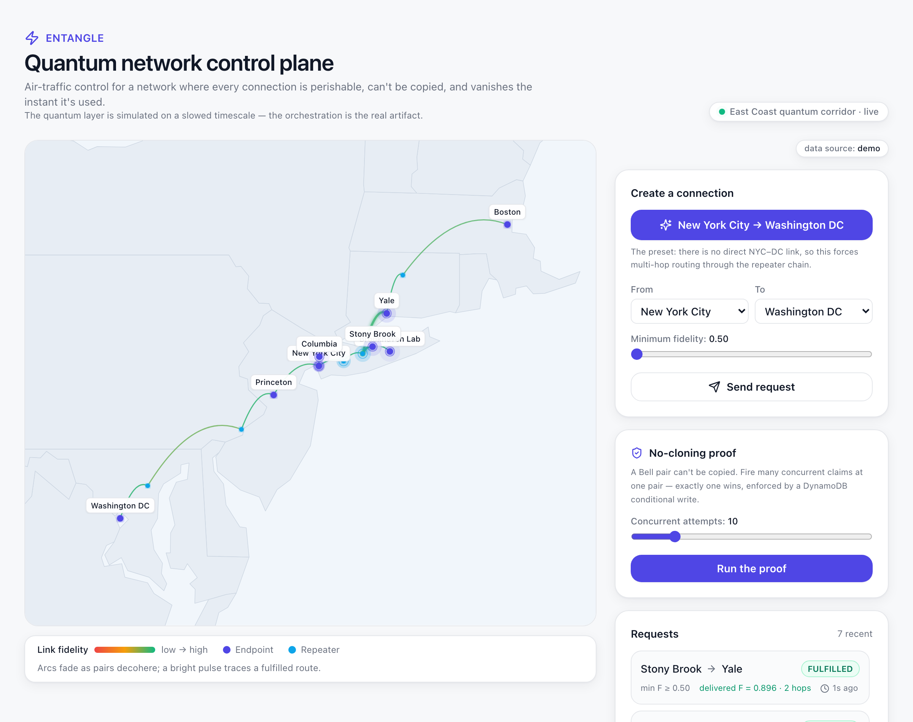

# Entangle

**Air-traffic control for a network where every connection is perishable, can't be copied, and vanishes the instant it's used.**

Entangle is a control plane for a **simulated quantum network**: a real-time
orchestration layer that tracks a stochastic, decaying inventory of entangled
pairs and routes end-to-end connections across repeater chains before the links
decohere.



> **Demo:** see [`DEMO.md`](DEMO.md) for a 3–4 minute judged-walkthrough script.

> ### Honesty note
> **The quantum layer is _simulated_ on a deliberately slowed timescale. The
> orchestration is the real artifact.** We do not use (and cannot access) real
> quantum hardware. We model the quantum physics with a physically-motivated
> decoherence model and build the genuinely novel software — the control plane —
> on top. This mirrors how the research field actually works: the classical
> control software is a real, separate engineering problem from the quantum
> devices it coordinates. Nothing here implies real-time control of real
> hardware.

## Real-world grounding

The seeded topology models a real US East Coast quantum testbed: the **New York
State Quantum Internet Testbed (NYSQIT) / SCY-QNet** on Long Island — a
collaboration of Stony Brook University, Brookhaven National Lab, Columbia, and
Yale spanning roughly 300 km of fiber. Its operators explicitly describe needing
"a classical internet to control and orchestrate the quantum networks." Entangle
is a working model of exactly that control layer, extended down a plausible
inter-city spine (NYC → Princeton → Philadelphia → Baltimore → DC). **We model
this testbed; we do not connect to it.**

## What makes the problem hard (and why a database design is the point)

An entangled (Bell) pair is unlike any classical resource:

- **Perishable** — its fidelity decays continuously (decoherence). We never store
  a mutating "current fidelity"; we store `initial_fidelity`, `decay_rate`, and
  `created_at`, and **compute** the live value (`F = F₀·e^(−k·Δt)`).
- **Non-copyable** — the no-cloning theorem: there is exactly one of each pair.
  We enforce this with a DynamoDB **conditional write** (`UpdateItem` with
  `ConditionExpression "status = AVAILABLE"`). A losing concurrent claim throws
  `ConditionalCheckFailedException` and triggers a re-plan.
- **Consumed on use** — using a pair destroys it.
- **Stochastically generated** — pairs appear probabilistically, not on a schedule.

Long-distance links are built by **entanglement swapping**: if A–B and B–C each
hold a pair, the middle node consumes both and leaves A–C entangled with fidelity
≈ the product of the inputs. Routing is therefore a *maximum-product-fidelity
path* search — implemented as a recursive CTE in Aurora.

## Architecture

```
                           ┌──────────────────────────────┐
                           │        @entangle/shared       │
                           │  types · fidelity math ·      │
                           │  topology · routing SQL       │
                           └───────────────┬──────────────┘
                          imported by      │      imported by
                ┌──────────────────────────┴───────────────────────────┐
                │                                                        │
   ┌────────────▼─────────────┐                          ┌──────────────▼─────────────┐
   │   packages/engine        │                          │        apps/web             │
   │  (long-running Node proc) │                          │   Next.js App Router        │
   │                          │                          │   → deploys to Vercel        │
   │  fixed-timestep loop:    │                          │                              │
   │   generate · decay ·     │                          │  /api/state  /api/request    │
   │   expire · route · swap · │                          │  /api/control /api/proof     │
   │   snapshot               │                          │  QuantumCorridorMap (SVG)    │
   └──────┬───────────┬───────┘                          └──────┬───────────┬──────────┘
          │           │                                         │           │
          │ live pairs│ topology/requests/events/routing/metrics│           │
          ▼           ▼                                         ▼           ▼
   ┌─────────────┐  ┌────────────────────────┐         ┌─────────────┐  ┌──────────────┐
   │  DynamoDB   │  │ Aurora PostgreSQL       │         │  DynamoDB   │  │   Aurora     │
   │EntangledPairs│ │ Serverless v2 (Data API)│         │ (live read) │  │ (Data API)   │
   │ TTL + GSIs  │  │ nodes/links/requests/…  │         └─────────────┘  └──────────────┘
   └─────────────┘  └────────────────────────┘
   The engine and the web app share the SAME two AWS databases.
```

The engine is a standalone long-running process (run locally for the demo, or in
a small container) — **not** a Vercel serverless function. The web app reads the
shared databases and lets you drive the simulation.

## Tech stack

- **Monorepo**: pnpm workspaces — `packages/shared`, `packages/engine`,
  `apps/web`, `infra`.
- **AWS DynamoDB** (live inventory) via `@aws-sdk/lib-dynamodb`.
- **AWS Aurora PostgreSQL Serverless v2** via the **RDS Data API**
  (`@aws-sdk/client-rds-data`) — so serverless functions don't exhaust DB
  connections.
- **Frontend**: Next.js 14 (App Router), Tailwind (configured **light**),
  framer-motion, Recharts, lucide-react. The network map is a data-driven SVG
  rendered over a real basemap of the US Northeast (state outlines projected with
  the same projection as the nodes, which sit on their true coordinates). The
  default view is intentionally minimal; charts/metrics/controls sit behind a
  "Show telemetry & controls" toggle.
- **Light theme only.** No `next-themes`, no `dark:` variants, no dark backgrounds.

## Getting started

### Prerequisites
- Node ≥ 20, pnpm 10, AWS CLI v2 configured.

### 1. Install
```bash
pnpm install
```

### 2. Provision AWS
See [`infra/README.md`](infra/README.md). In short:
```bash
cd infra
./provision-dynamodb.sh
./provision-aurora.sh        # copy the printed ARNs into .env
```

### 3. Configure env
```bash
cp .env.example .env         # fill in AWS region + the Aurora ARNs
```

### 4. Migrate + seed
```bash
pnpm infra:migrate
pnpm infra:seed
```

### 5. Run
```bash
pnpm dev:engine              # the simulation (long-running)
pnpm dev:web                 # the control-plane UI at http://localhost:3000
```

## Environment variables

See [`.env.example`](.env.example). Summary:

| Variable | Purpose |
|----------|---------|
| `AWS_REGION` | AWS region for both databases |
| `AWS_ACCESS_KEY_ID` / `AWS_SECRET_ACCESS_KEY` | Credentials (or use `AWS_PROFILE`) |
| `DYNAMODB_TABLE` | Pair-inventory table name (`EntangledPairs`) |
| `AURORA_CLUSTER_ARN` | Aurora cluster ARN (Data API) |
| `AURORA_SECRET_ARN` | Secrets Manager ARN for DB credentials |
| `AURORA_DATABASE` | Logical database name |
| `ENGINE_*` | Default sim tuning (also runtime-tunable in the UI) |

## Deploying the web app to Vercel

1. Push the repo to GitHub.
2. Create a Vercel project, set the **Root Directory** to `apps/web`.
3. Add the same AWS env vars in the Vercel project settings.
4. Deploy. The engine stays running locally (or in a container) against the same
   AWS databases.

## Build order / status

- [x] **Phase 0** — monorepo scaffold, shared types + fidelity math, infra
  provisioning, Aurora migration + seed, `.env.example`, README.
- [x] **Phase 1** — DynamoDB + Aurora Data API clients (atomic allocate/release).
- [x] **Phase 2** — engine tick loop (generate / decay / expire).
- [x] **Phase 3** — Next.js app + `/api/state` + live corridor map.
- [x] **Phase 4** — requests + recursive-CTE routing + atomic reservation + swaps.
- [x] **Phase 5** — dashboards, timeline, controls, no-cloning proof, responsive pass.
- [ ] Phase 6 (optional) — real AWS Braket entanglement-swap circuit on one QPU.

### Running offline (no AWS)

The web app ships with an in-process **demo simulator** that reuses the exact
shared math + topology. With no AWS configured (or `ENTANGLE_DEMO_MODE=1`), the
entire UI — map, routing, dashboards, controls, inject-failure, and the
no-cloning proof — runs end-to-end locally. The `X-Entangle-Source` response
header reports whether a response came from `aws` or `demo`.

```bash
cd apps/web && ENTANGLE_DEMO_MODE=1 pnpm dev   # http://localhost:3000
```

### API

| Route | Method | Purpose |
|-------|--------|---------|
| `/api/state` | GET | Full snapshot the UI polls (~400ms): nodes, links w/ live fidelity, live pairs, requests, events, metrics, `activePath`. |
| `/api/request` | POST | Create a PENDING connection request `{ src, dst, min_fidelity }`. |
| `/api/control` | POST | Tune gen rate / decoherence / floor / pause, or inject a link failure. |
| `/api/proof` | POST | Fire N concurrent claims at one pair — exactly 1 wins (no-cloning). |

## License

MIT (hackathon project).
